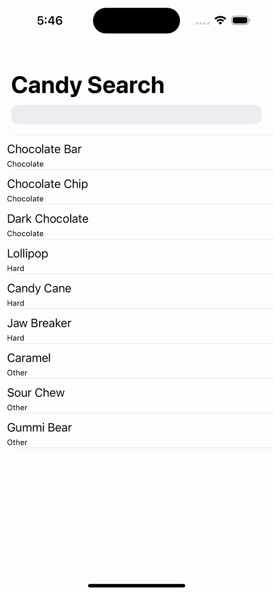
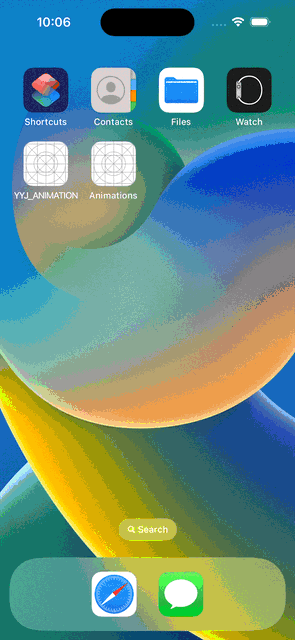
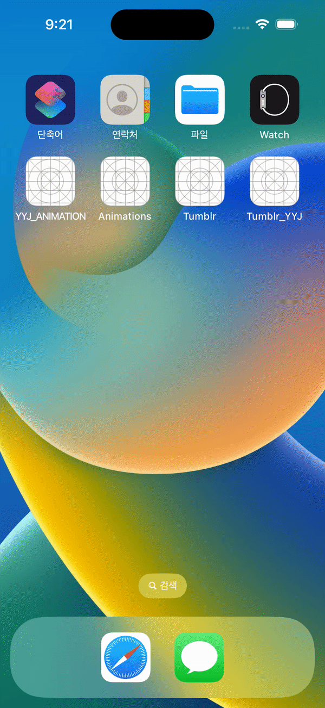
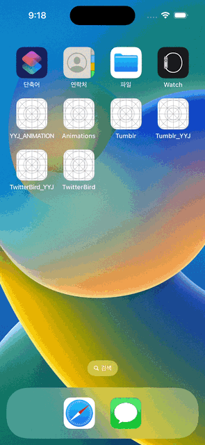
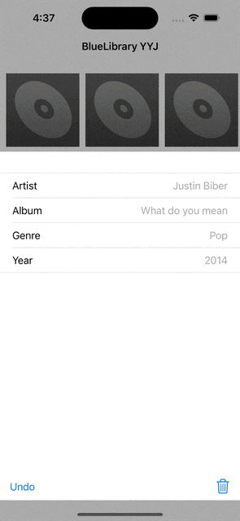

# ios-project
ios 개발에 사용되는 기본적인 프로젝트들을 모아둔 레파지토리입니다. 

# 프로젝트 설명

1. reFaceBookMe: FaceBook 의 설정 화면을 구현한 내용입니다. 
2. reFoodAsOldPhone: 옛날 핸드폰의 제품을 보여주는 내용입니다.
3. reiPhoneSettingApp: 아이폰 셋팅 앱을 일부 구현한 내용입니다. 
4. reMovieApp: api를 이용하여 영화를 검색하고 이에 대한 세부 내용을 볼수 있도록 구현한 내용입니다.
5. reStopWatch: 스탑워치를 구현한 내용입니다. 
    * 해당 프로젝트를 통해 시간 데이터를 다루는 법과 RunLoop에 대해서 알 수 있습니다. 
6. reTodoList: 간단한 TodoList를 구현한 내용입니다. 
7. Artisty_YYJ: json 파일에 저장되어있는 화가 데이터를 읽어 이를 테이블뷰로 보여주는 프로젝트 입니다. 
    * 해당 프로젝트를 통해서 json 파일 다루기, segue 에 데이터 전달을 다룰수 있습니다. 
    * 
8. CandySearch_YYJ: candy 목록을 검색하고 클릭시 물품 사진을 보여주는 프로젝트입니다.
    * 해당 프로제그를 통해서 ui search bar 를 다루는 법을 배울 수 있습니다.
    * 
9. simpleRSSReader: url parsing 을 통해서 데이터를 추출하고 가공하는 기능을 구현한 내용입니다.
    * 해당 프로젝트를 통해서 xml parsing, URLsession 을 다루는 법을 배울 수 있습니다.
    * 
10. PhotoScroll_YYJ: 저장되어있는 이미지를 collection view 로 불러오고 이를 클릭시 세부 viewControll 을 볼수 있게 구현한 내용입니다.
    * 해당 프로젝트를 통해서, UICollectionViewController, onboarding 을 배울 수 있습니다.
    * 
11. YYJ_ANIMATION: uiview 에 등록되어있는 도형들의 animation 효과 및 tableview 의 animation 효과를 구현한 내용입니다.
	* 해당 프로젝트를 통해서, uiview와 tableView 의 animation 효과 적용을 배울 수 있습니다. 
	* 
12. Tumblr_YYJ: navigation tool bar 를 이용하여 animation 효과를 구현한 내용입니다. 
    * 해당 프로젝트를 통해서, dismiss 함수에 animation 을 적용시킬 수 있습니다.
	* 
13. TwitterBird_YYJ: SceneDelegate 에 있는 UIWindow를 이용하여 시작 화면에 animation을 구현하는 내용입니다.
	* 해당 프로젝트를 통해서, 이미지의 사진 색을 배경과 반대로 해서 애니메이션으로 만들 수 있습니다.
	* 
14. BlueLibrarySwift_YYJ: json으로 되어있는 엘범 데이터를 읽어서 정보를 보여주고, 삭제 및 undo 를 할 수 있는 구현 내용입니다. 
	* 해당 프로젝트를 통해서, scrollView 를 공부할 수 있습니다.
	* 
